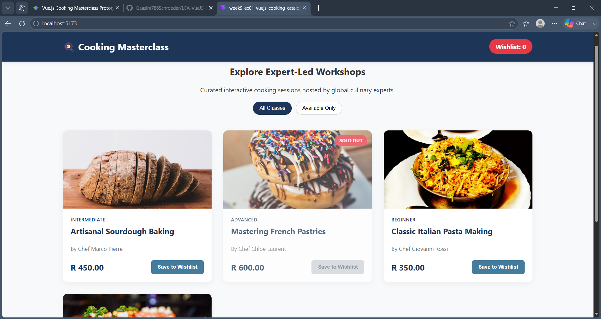

# Cooking Masterclass Single-Page Catalogue Prototype

### Brief Project Overview

A clean and user-friendly single-page web application built with Vue 3 and Vite. This prototype serves as a responsive catalogue showcasing available cooking workshops hosted by expert chefs, allowing users to browse courses, see pricing, track "Sold Out" status, and dynamically add available classes to a wishlist that updates a counter in the header.

### Interface Prototype View



### Technical Scope & Key Features

- Component-driven design using props, data, and events.
- Responsive layout optimized for both desktop and mobile devices.
- Interactive wishlist button toggling with reactive state updates.
- Custom filter handling to toggle between viewing all classes or only available classes.
- Branded minimalist styling using clean custom CSS variables.

### Installation and Run Instructions

Follow these steps to set up and run the project locally on your machine:

1. **Clone the repository branch:**
   ```bash
   git clone [https://github.com/Qaasim786Schroeder/LCA-VueJS-Exercises.git](https://github.com/Qaasim786Schroeder/LCA-VueJS-Exercises.git)
   cd week9_ex01_vuejs_cooking_catalogue
   git checkout week9-vuejs-ex01
   ```
